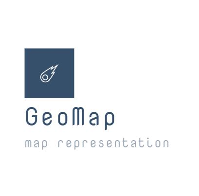
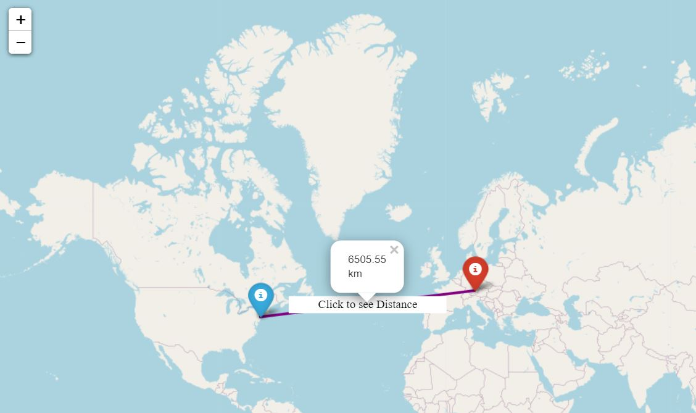
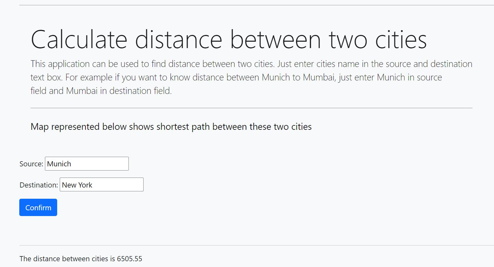
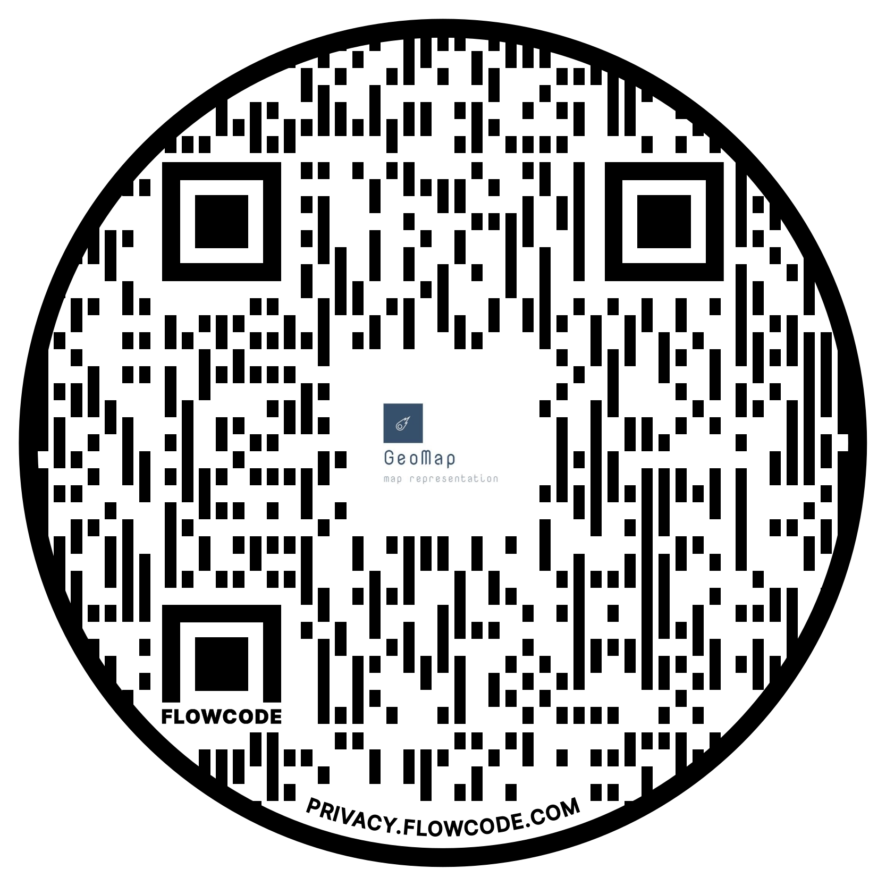

    
# GeoMap Distance calculator

This application can be used to find distance between two cities. Just enter cities name in the source and destination text box. For example if you want to know
                distance between Munich to Mumbai, just enter Munich in source.
[Go to website](https://maphamzah.herokuapp.com/)

## views.py
This script will run the function that will interpret context dictionary and substitute in base.html and main.html in place of django template tagging.

## settings.py
This script contains important settings of the project such as static root directory, template directory, installed apps, middleware etc

## Authors

[@Hamzahshabbir](https://github.com/hamzahshabbir96)

## Acknowledgements

 - [Django](https://awesomeopensource.com/project/elangosundar/awesome-README-templates)
 - [Folium](https://pypi.org/project/folium/0.1.5/)
 - [maxmind.com](www.maxmind.com)

## Screenshots

## Feedback

If you have any feedback, please reach out to us at hamzahshabbir7@gmail.com

  
## 🔗 Links

  
## FAQ

#### 1. What this project is about?

This project calculates distance between two cities and represt in the form of embedded map in html with the help of folium library.
#### 2. Has this app been deployed? 

Yes this app has been deployed on heroku cloud server. It can be followed from here : [Go to website](https://maphamzah.herokuapp.com/)

#### 3. Is it open source project?

It is open source project except database for countries and cities which were downloaded from https://www.maxmind.com/en/geolite2/eula. you can go and follow steps touse or buy their datab.
Note: This project is not for commercial purpose.

#### 3. Can I use your code?

If you are really interested in this project then you can collab with me and we can furthur improve model. You can reach me by my email hamzahshabbir7@gmail.com or [linkedIn](https://www.linkedin.com/in/hamzah-shabbir-108765a5/). 
